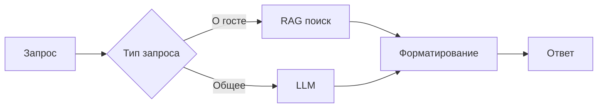

# Урок 29. Создание RAG-инструмента для информации о гостях

## Цель

Разработка системы для быстрого доступа к информации о гостях гала-ужина с использованием RAG (Retrieval-Augmented Generation)

## Структура проекта

project/
├── tools.py # Вспомогательные инструменты
├── retriever.py # Логика поиска информации
└── app.py # Основное приложение

## 1. Подготовка данных

Загрузка и преобразование данных о гостях:

```python
from datasets import load_dataset
from langchain_core.documents import Document

dataset = load_dataset("agents-course/unit3-invitees", split="train")

docs = [
    Document(
        page_content=f"Name: {guest['name']}\nRelation: {guest['relation']}\nDescription: {guest['description']}\nEmail: {guest['email']}",
        metadata={"name": guest["name"]}
    )
    for guest in dataset
]
```

## 2. Создание инструмента поиска

Реализация Retriever Tool с использованием BM25:

```python
from langchain_community.retrievers import BM25Retriever
from smolagents import Tool

class GuestInfoTool(Tool):
    name = "guest_info"
    description = "Поиск информации о гостях по имени или связи с организатором"

    def __init__(self, docs):
        self.retriever = BM25Retriever.from_documents(docs)

    def forward(self, query: str):
        results = self.retriever.get_relevant_documents(query)
        return "\n\n".join(doc.page_content for doc in results[:3]) if results else "Гость не найден"
```

## 3. Интеграция с агентом

Создание агента Alfred с инструментом поиска:

```python
from smolagents import CodeAgent, InferenceClientModel

model = InferenceClientModel()
guest_tool = GuestInfoTool(docs)

alfred = CodeAgent(tools=[guest_tool], model=model)
```

## Примеры использования

### Поиск информации о госте

```python
response = alfred.run("Расскажи о леди Аде Лавлейс")
print(response)
```

**Пример вывода:**

Имя: Леди Ада Лавлейс
Связь: Друг
Описание: Математик, первый программист, работала с Аналитической машиной Бэббиджа
Email: ada.lovelace@example.com

### Автоматизация общения

```python
alfred.run("Кто этот человек у фонтана? Он упомянул что работал с электричеством")
```

## Возможные улучшения

1. **Улучшенный поиск**:

   ```python
   from langchain.embeddings import OpenAIEmbeddings
   from langchain.vectorstores import FAISS

   vectorstore = FAISS.from_documents(docs, OpenAIEmbeddings())
   ```

2. **Динамическое обновление**:

   - Интеграция с Google Sheets для актуальных данных
   - Веб-поиск последних новостей о гостях

3. **Контекст диалога**:

   ```python
   from langchain.memory import ConversationBufferMemory

   memory = ConversationBufferMemory()
   alfred = CodeAgent(..., memory=memory)
   ```

## Ключевые особенности

- Локальное хранение конфиденциальных данных (emails, связи)
- Быстрый поиск по различным атрибутам
- Интеграция в существующую систему агента
- Возможность расширения функционала


