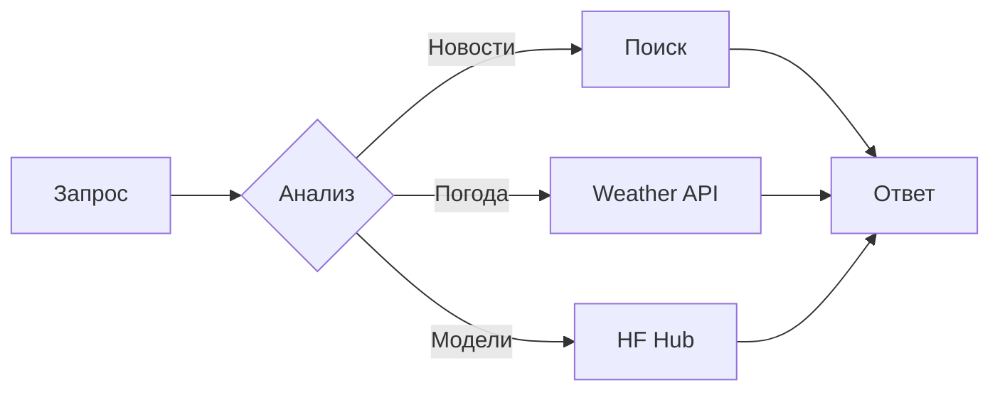

# Урок 30. Интеграция инструментов для агента

## Основные компоненты системы

1. Веб-поиск (DuckDuckGo)
2. Погодный API
3. Статистика моделей Hugging Face

## 1. Инструмент веб-поиска

```python
from smolagents import DuckDuckGoSearchTool

search_tool = DuckDuckGoSearchTool(
    name="web_search",
    description="Поиск актуальной информации в интернете"
)
```

## 2. Погодный инструмент

### Тестовая реализация:

```python
class WeatherTool(Tool):
    def forward(self, location: str):
        conditions = ["Ясно", "Дождь", "Облачно"]
        temp = random.randint(-10, 30)
        return f"{location}: {random.choice(conditions)}, {temp}°C"
```

### Реальная интеграция с API:

```python
class OpenWeatherTool(Tool):
    def forward(self, location: str):
        response = requests.get(
            f"https://api.openweathermap.org/data/2.5/weather?q={location}&appid=API_KEY&units=metric"
        )
        data = response.json()
        return f"{data['name']}: {data['weather'][0]['description']}, {data['main']['temp']}°C"
```

## 3. Статистика Hugging Face

```python
from huggingface_hub import list_models

class HFStatsTool(Tool):
    def forward(self, author: str):
        top_model = next(list_models(author=author, sort="downloads", direction=-1, limit=1))
        return f"Топ модель {author}: {top_model.id} ({top_model.downloads:,} загрузок)"
```

## Интеграция в агента

```python
alfred = CodeAgent(
    tools=[search_tool, WeatherTool(), HFStatsTool()],
    model=InferenceClientModel()
)
```

## Примеры работы

### Получение погоды:

```python
response = alfred.run("Нужно ли переносить фейерверк из-за погоды в Лондоне?")
```

### Поиск информации:

```python
response = alfred.run("Какие последние новости об ИИ?")
```

## Оптимизации

1. **Кеширование**:

```python
from functools import lru_cache

@lru_cache(maxsize=100)
def cached_weather(location: str):
    return weather_tool(location)
```

2. **Обработка ошибок**:

```python
class SafeTool(Tool):
    def __call__(self, *args, **kwargs):
        try:
            return super().__call__(*args, **kwargs)
        except Exception as e:
            return f"Ошибка инструмента: {str(e)}"
```

## Архитектура системы



## Ключевые особенности:

- Гибкая интеграция внешних сервисов
- Поддержка как тестовых, так и рабочих API
- Модульная архитектура для легкого расширения
- Встроенные механизмы оптимизации и обработки ошибок
